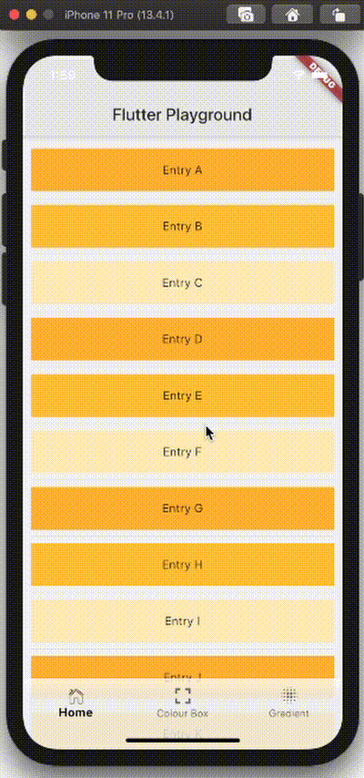

# Flutter Playground

A  Flutter project to explore the framework.    
The app has a bottom navigation bar where the user can navigate between three pages:
 - Home page: Scrollable list of 'containers' which can be turned into buttons, 
 information dialogs, etc.. Currently, if one of the containers is 
 tapped, the colour shade of all containers switch randomly. 
 - Colour Box: Page with a box that 
the user can tap to alternate the colour of.
 - Gradient: Page containing a radial
gradient and four buttons that the user can press to
(randomly) change the colours of the gradient. Upon entry to this page,
the user is alerted with a popup dialog as to what the buttons do.

### Demo

#### Resources used
- https://www.udemy.com/course/flutter-dart-the-complete-flutter-app-development-course/
- [Lab: Write your first Flutter app](https://flutter.dev/docs/get-started/codelab)
- [Cookbook: Useful Flutter samples](https://flutter.dev/docs/cookbook)
- [online documentation](https://flutter.dev/docs)

Author: GKW